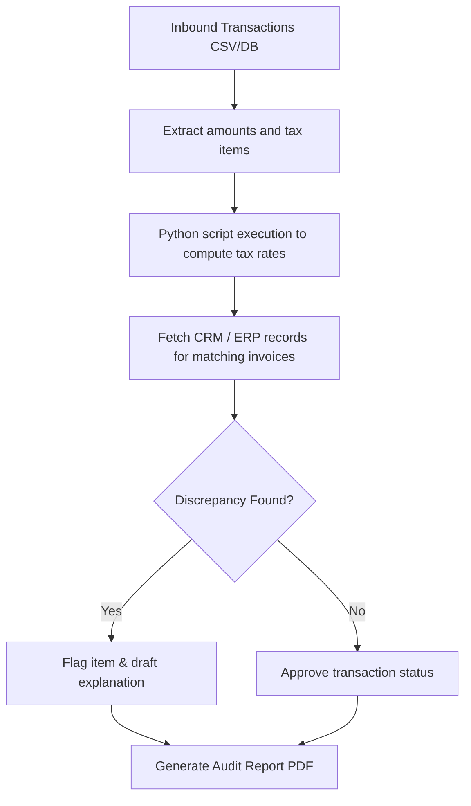

# Automated Corporate Financial & Tax Auditing Workflows

This application demonstrates agentic pipelines executing financial reconciliation, parsing transaction databases, matching invoices, and automatically calculating compliance risks.

## Auditing Workflow

## Advantage
- **Reduction of human error:** Verifies huge datasets deterministically.
- **Explainability:** Generates full audit logs step-by-step.
