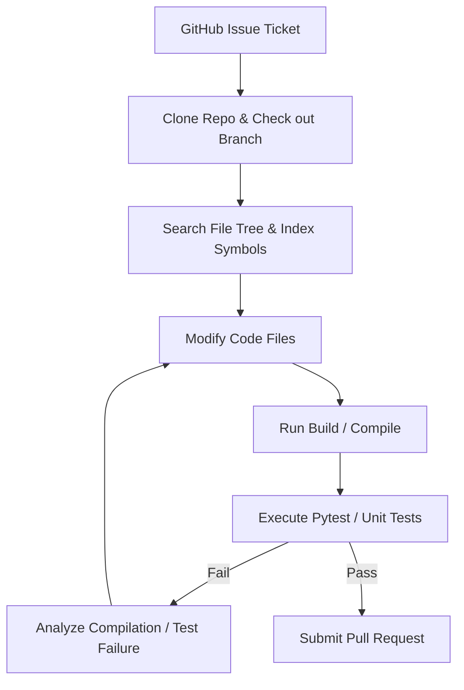

# Autonomous Software Development & Repository Maintenance (Devin / SWE-Agents)

This industrial application involves agent architectures capable of fixing coding bugs, running compilers, testing patches, and resolving issue tickets autonomously.

## Workflow

## Significance
- **Complex Workflows:** Combines terminal, editor, and compiler interfaces.
- **Iterative Debugging:** Fixes errors using log feedback.
