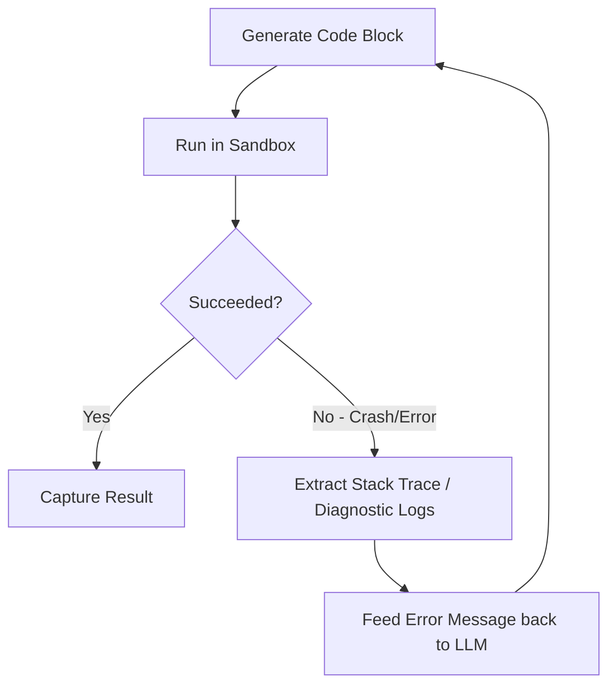

# Closed-Loop Self-Correction / Sandboxed Compilation

This variant automates code or tool parameter execution by running them in a compiler sandboxed loop and analyzing compiler error diagnostics to recursively self-correct bugs.

## Debugging Loop

## Significance
- **Autonomy:** Eliminates human debugging interventions.
- **Reliability:** Ensures compiler verification before final output submission.
