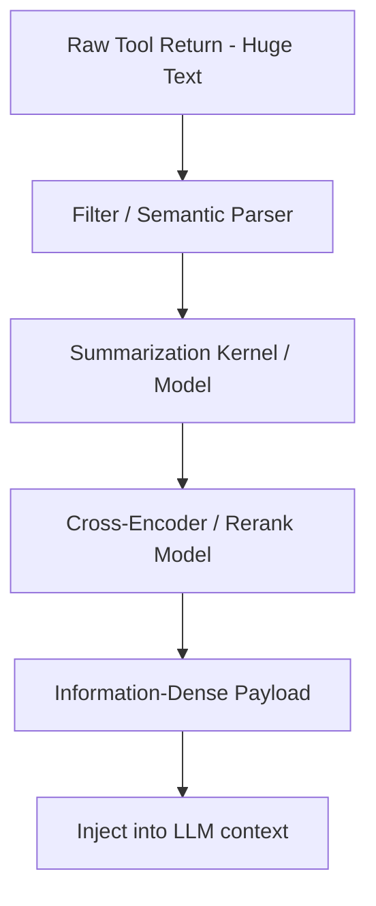

# The Context Window Inflation & Latency Bottleneck

Massive tool returns (e.g. databases, webpage raw contents) cause rapid inflation of the model context window. This creates context management and API cost/throughput bottlenecks.

## Mitigation Pipeline

## Optimizations
- **Text Compression:** Exclude boilerplate headers and formatting logs.
- **Dynamic Summarizers:** Pre-summarize outputs before injecting them into main model context window.
