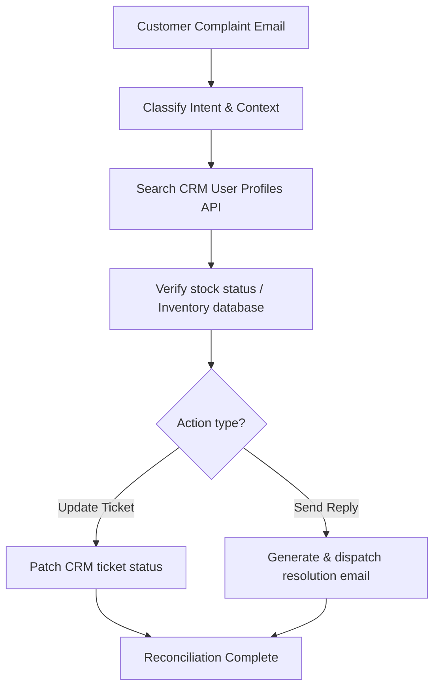

# Enterprise Customer Relationship Management (CRM) Orchestration

Integrating tool-using LLMs into CRM systems (like Salesforce, HubSpot) transforms passive databases into automated systems capable of dynamically managing accounts, orders, cases, and logs.

## Pipeline

## Significance
- **Autonomous Support:** Resolves multi-tiered customer requests without manual interventions.
- **Enterprise Consistency:** Keeps central records updated in real time.
