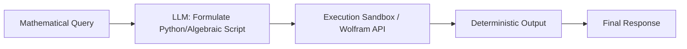

# Deterministic Mathematical & Symbolic Compilers

Deterministic compilers allow the LLM to delegate computational tasks to specialized algebraic engines or code interpreters (e.g. Python REPL, Wolfram Alpha) instead of performing mathematics in its parameters.

## Computational Pipeline

## Impact
- **Absolute Precision:** Solves calculations that neural nets cannot perform natively.
- **Symbolic Reasoning:** Converts semantic concepts to formal code representations.
