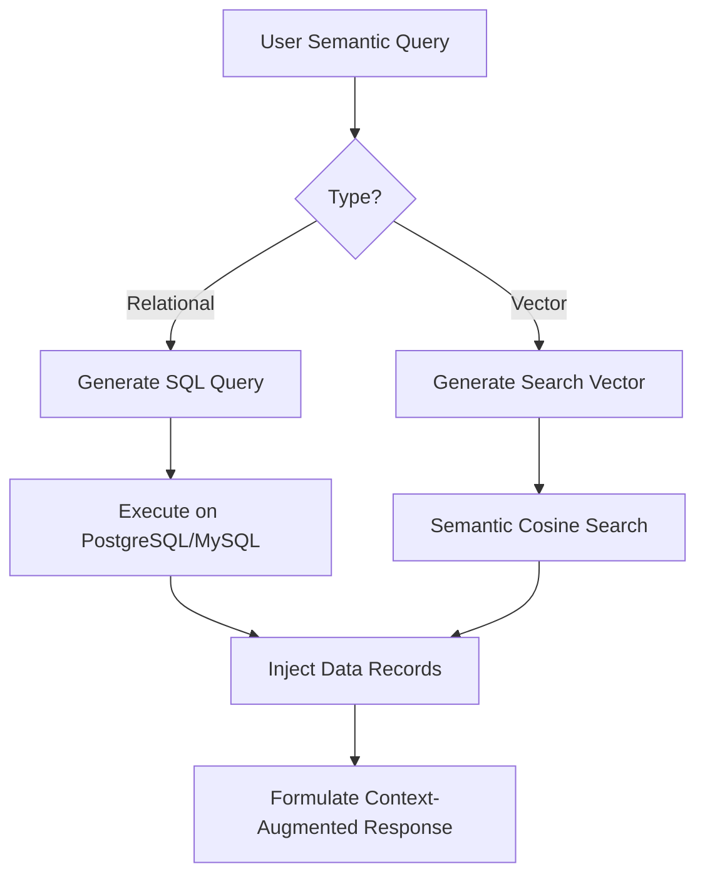

# Dynamic Structural Data Stores (SQL / Vector Databases)

This capability covers connecting models directly to data structures such as relational SQL engines and Vector Indexes to retrieve dynamic, structured, or semantic information.

## Access Flow

## Significance
- **Real-Time Data Integration:** Bypasses parametric memory limitations.
- **Structured Operations:** Allows filter, join, and retrieval constraints.
