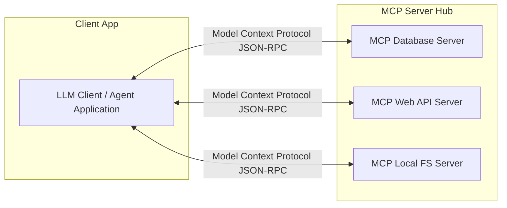

# Model Context Protocol (MCP) Era (~2025–Present)

The **Model Context Protocol (MCP)** is an open standard that decouples models and tool-using clients from the servers hosting actual tools. It introduces a unified, secure client-server paradigm.

## System Architecture

## Core Protocol Features
- **Dynamic Tool Discovery:** Clients can list available tools dynamically upon server initialization.
- **Resource Management:** Read-only data resources (files, tables) can be browsed standardly.
- **Unified Security:** Authorization and sandboxing policies are decoupled from the client.
