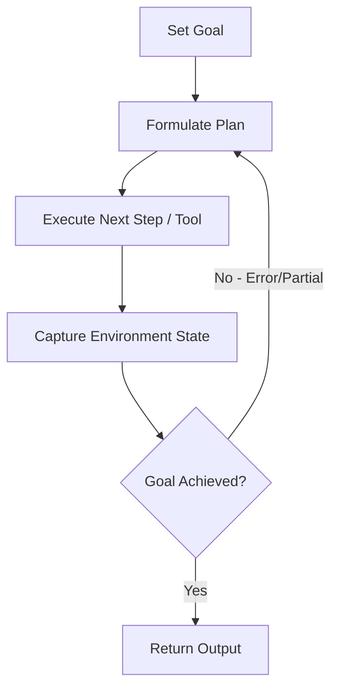

# Multi-Step Autonomous Loops (Agentic Tool Use)

Agentic tool use leverages multi-step loops where the LLM evaluates the result of intermediate actions and iteratively updates its planning trace to execute consecutive operations.

## Loop Lifecycle

## Features
- **Adaptive Execution:** Handles unforeseen failures or edge cases dynamically.
- **State Maintenance:** Requires context tracking to hold intermediate states.
