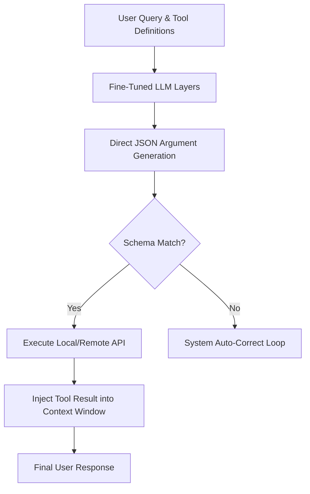

# Native JSON Schema Function-Calling Era (~2023–2025)

Native function calling represents a transition where Large Language Models are fine-tuned to emit structured data directly matching JSON or XML schemas, bypassing text-based template formatting constraints.

## Technical Architecture

## Key Advancements
- **Fine-tuned Weights:** Models are trained on specialized token structures to understand functions and argument mappings natively.
- **Parallel execution:** Native APIs support generating multiple tool calls in a single inference step.
- **Robustness:** Eliminates template breakdown issues common in prompt-based approaches.
