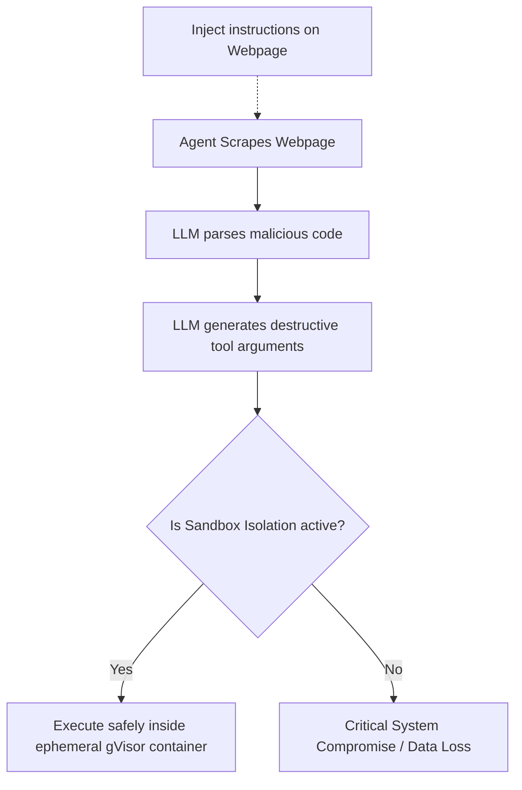

# Remote Code Execution (RCE) Prompt Injection Hazard

Autonomous execution models are vulnerable to indirect prompt injection: malicious payloads inside untrusted websites or data sources hijack the system prompt and execute actions (e.g. system commands, database drops).

## Attack Vector and Sandbox Mitigation

## Security Best Practices
- **Strict Sandboxing:** Run code execution models in ephemeral, rootless environments.
- **Human-in-the-Loop:** Require authorization for destructive changes (FS, database writes).
