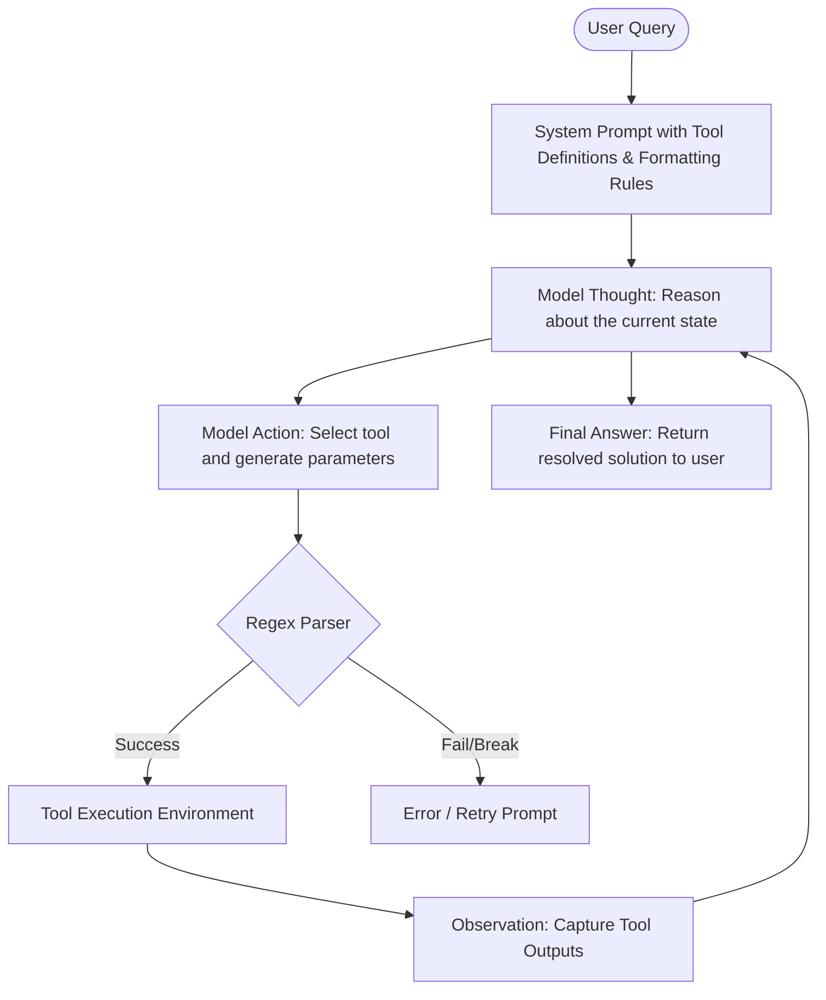

# The Prompt-Based ReAct Era (~2022–2023)

The **ReAct (Reason + Act)** framework is a paradigm that combines reasoning (e.g., chain-of-thought prompting) with acting (e.g., executing actions via external APIs) in an alternating loop. This design allows LLMs to solve tasks iteratively, evaluating their intermediate status before performing subsequent steps.

## Architectural Overview

Below is a visualization of the classic ReAct execution flow:

## Key Characteristics & Challenges

1. **Prompt Scaffolding:** Unlike native integrations, ReAct relies entirely on strict text templates (e.g., `Thought: ...`, `Action: ...`, `Observation: ...`).
2. **Regex Dependency:** Output parsing is done via regular expressions or string matching, making it highly fragile.
3. **Context overhead:** The entire history of thoughts, actions, and observations is appended to the context window, causing exponential token consumption.
