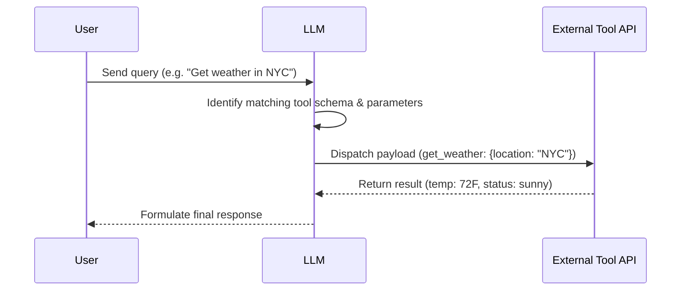

# Single-Turn Function Dispatch

Single-turn function dispatch refers to situations where an LLM is expected to map a user request directly to a single execution signature and complete the action in one round-trip.

## Sequence Flow

## Key Aspects
- **Low Latency:** Optimized for immediate action execution.
- **High Determinism:** Simple parameter matching with minimal agentic decision branches.
