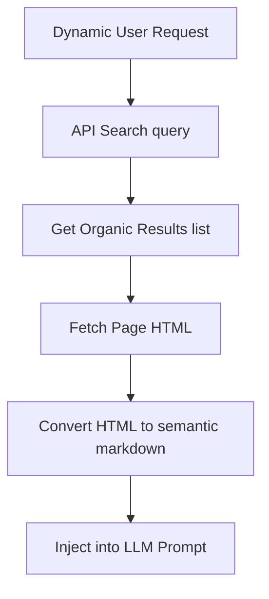

# Web Crawlers & Real-Time Search Engines

LLMs integrated with search engines and crawlers navigate the live web to fetch documents, keeping the model context up to date with continuous real-world changes.

## Navigation flow

## Features
- **Temporal Alignment:** Avoids limitations caused by model knowledge cutoff.
- **Fact Verification:** Cross-references assertions against online directories.
